% Étendre des interpréteurs par détournement   ou   Comment étendre des interpréteurs sans en modifier le code
% fmdkdd
% Mines Nantes, 18 novembre 2016

<!-- TODO: fix slide numbers in overview -->
<!-- TODO: incremental overlay should start with first item, not empty -->

# Préliminaires

## Le cycle de vie d'un programme

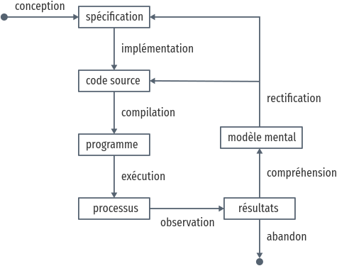

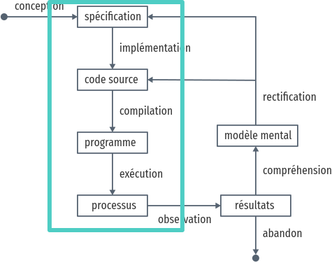

## De la spécification au processus

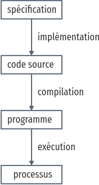

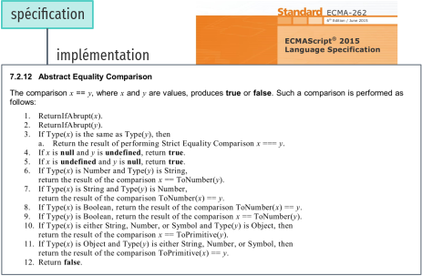

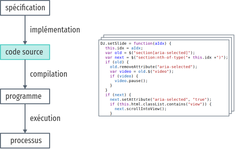

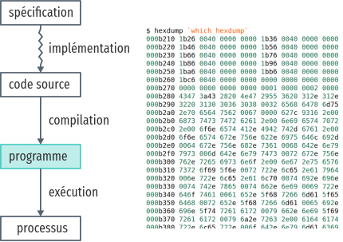

<pre style="position:absolute; top: 450px; left: 350px"><code>1 + 1 == 2 //: true
"12" == 12 //: true
[] == "" //: true
</pre></code>
<video src="img/visual-6502.mp4" style="width:400px; position:absolute; left: 330px; top: 120px" loop="true">

- ECMA6: 566 pages

## La correspondance processus—programme

Appuyer sur Ⓐ pour sauter

<pre><code style="font-size: 16px">
function loop() {
  if (jumping) {
    y += 32
    sprite_x = 160
  }

  if (y > 0) {
    y -= 12
  }
  else {
    y = 0
    sprite_x = 80
  }
}
</code></pre>

<pre style="position:absolute; left: 300px; top: 300px;">
<code>key: 
jumping: 
y: 
sprite_x: 
</code></pre>

<canvas id="jumping-jack-canvas" style="position:absolute; right: 100px; bottom: 100px;" width="200px" height="550px"></canvas>

- All are different views of the same thing
- 3 states (ascent, descent, ground) for 3 "if" blocks

# Le problème

## Étendre des interpréteurs pour des analyses de sécurité

Context sécurité JS, SecCloud

## Modifier l'interpréteur

---

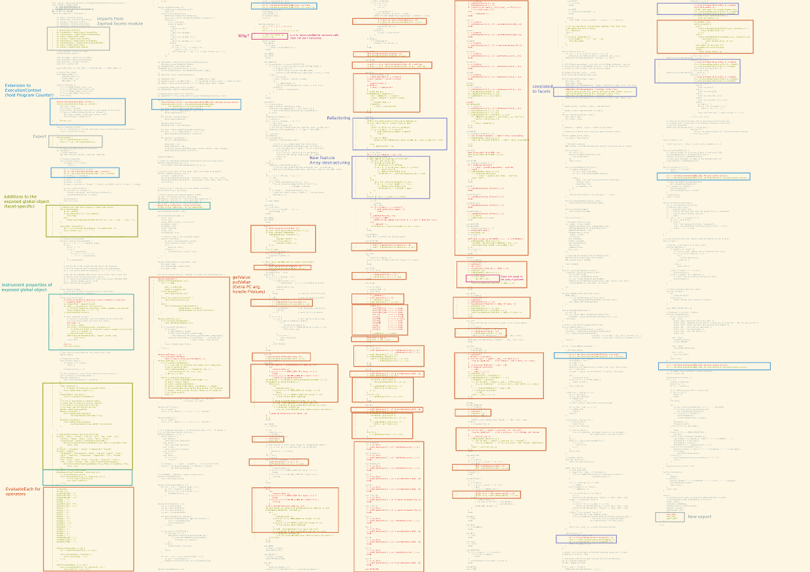

---

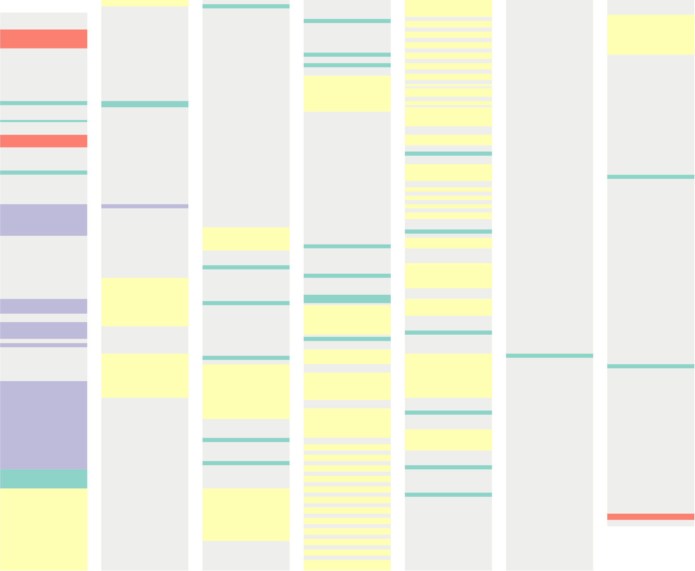

## Modifier l'interpréteur

Différentes façons de faire

Mais l'instrumentation de Narcissus n'est pas idéale dans ce contexte

On veut:

- rapidité de prototypage
- minimiser les changements du code de l'interpréteur pour ne pas complexifier
  le code
- séparer le code des analyses pour pouvoir les auditer séparément

Refactor fails the first two counts

## Détourner l'interpréteur

Venir se brancher juste au bon endroit
-> rapidité
-> changement de code minimes
-> code des analyses séparé

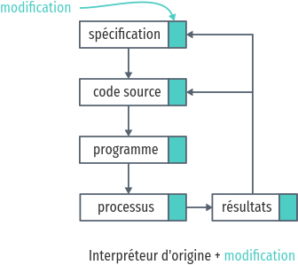

# Construire un interpréteur par modules

## Utiliser `with`

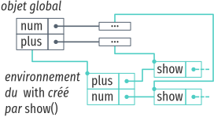

# Étendre Narcissus par manipulation de portée

## Le motif module

Complexité supplémentaire de Narcissus

Le motif module verrouille l'extension

## Ouvrir le motif module

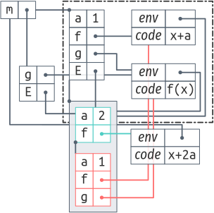

## Évaluation

- 4 analyses ajoutées
- XX lignes modifiées (vizu du diff avant/après?)

- spécifique à ce cas précis

# Conclusions

## Détourner pour étendre et modifier un programme

Plus rapide et moins risqué que la refactorisation.  Choix pragmatique dans les
des circonstances adéquantes.

Pas une balle en argent: spécifique à chaque scénario

## Indirection -> détournement

N'importe quel mécanisme d'indirection suffit pour le détournement.

`with`, inversion of control, AspectJ, ...

## Détournement -> indirection

Détourner c'est laisser un trou béant, c'est casser la membrane du module

L'un ne va pas sans l'autre

# Extra credit

## Contrôler le détournement

Possible de retourner un proxy sur l'objet scope qui empêche de modifier
n'importe quelle référence, en utilisant une whitelist par exemple.

Ou bien le symbole spéciale `unscopables`.
