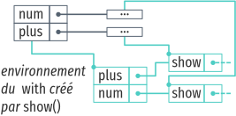

% Étendre des interpréteurs par détournement, ou comment étendre des interpréteurs sans en modifier le code
% fmdkdd
% Mines Nantes, 18 novembre 2016

# Le problème

---

---

# Construire un interpréteur par modules

## Utiliser `with`

# Étendre Narcissus par manipulation de portée

## Ouvrir le motif module

